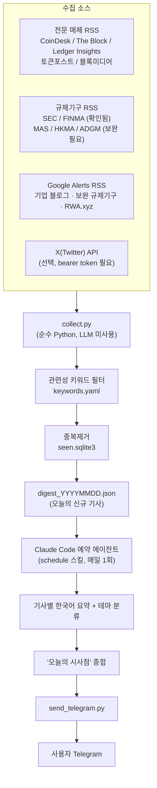

# RWA / 디지털자산 / 토큰화 증권·펀드 / 스테이블코인 / 온체인 금융 데일리 다이제스트

RWA(Real-World Asset), 토큰화 증권/펀드, 스테이블코인, 온체인 금융 관련 주요
사업자·전문 미디어·규제기구의 뉴스를 매일 자동 수집해 한국어로 요약하고
시사점(implication)을 뽑아 Telegram으로 보내는 파이프라인.

## 1. 설계 개요

### 1.1 왜 이런 구조인가

- **수집(RSS)과 지능(요약/시사점 추출)을 분리**했다. RSS 수집·중복제거는
  결정론적 작업이라 별도 LLM 호출 없이 순수 Python 스크립트로 처리한다.
  요약과 시사점 추출처럼 판단이 필요한 부분만 Claude Code 예약 에이전트가
  맡는다. 이렇게 하면:
  - 별도 Anthropic API 키/과금이 필요 없다 (이미 있는 Claude Code 세션의
    reasoning을 그대로 활용).
  - 수집 로직이 사람이 읽고 디버깅하기 쉬운 일반 코드로 남는다.
  - PC를 켜둘 필요가 없다 — 예약 에이전트는 클라우드에서 실행된다.
- **소스별로 신뢰도가 다르므로 3단계로 나눴다**:
  1) RSS가 확실히 있는 전문 매체/규제기구는 직접 RSS로 수집.
  2) RSS가 없거나 불안정한 기업 블로그·일부 규제기구(MAS, ADGM 등)는
     **Google Alerts를 RSS로 변환**해 보완 채널로 흡수한다. Google Alerts는
     사실상 "무엇이든 RSS로 바꿔주는" 범용 크롤러이므로 별도 스크래퍼를
     직접 짜는 것보다 훨씬 안정적이고 유지보수가 쉽다.
  3) X(Twitter)는 공식 API(유료)가 있을 때만 켜지는 선택적 채널로 두었다.
     스크래핑 기반 우회는 X 이용약관 위반 소지가 있어 채택하지 않았다.
- **관련성 필터를 소스 성격에 따라 다르게 적용**한다. CoinDesk/The
  Block처럼 암호화폐 전반을 다루는 매체는 키워드 필터(`filter: true`)를
  거쳐 RWA/토큰화/스테이블코인 관련 기사만 통과시키고, Ledger Insights처럼
  이미 엔터프라이즈 블록체인에 특화된 매체나 Google Alerts(이미 검색어
  자체가 필터)는 필터 없이 전량 수용한다.

### 1.2 아키텍처



### 1.3 단계별 설명

| 단계 | 파일 | 역할 |
|---|---|---|
| 소스 정의 | `config/sources.yaml` | 매체/규제기구/Google Alerts/X 소스 목록, 소스별 필터 여부 |
| 관련성 필터 | `config/keywords.yaml` | RWA/토큰화/스테이블코인 등 include 키워드, 오탐 방지 exclude 키워드 |
| 수집+중복제거 | `src/collect.py` | RSS 파싱 → 필터 → `seen.sqlite3` 대조 → 신규 기사만 JSON 출력 |
| 중복 저장소 | `src/store.py` | URL SHA256 해시 기반 SQLite seen-store |
| 소스 상태 점검 | `src/check_sources.py` | 등록된 피드가 살아있는지 수시 점검하는 유틸리티 |
| 요약/시사점/발송 지시서 | `AGENT_PROMPT.md` | 예약 에이전트가 매일 그대로 따르는 절차 (요약 규칙, 메시지 템플릿) |
| 발송 | `src/send_telegram.py` | 완성된 다이제스트 텍스트를 Telegram Bot API로 전송 (4096자 청크 분할) |

## 2. 소스 목록과 확인 상태 (2026-08-17 기준)

| 카테고리 | 소스 | 상태 |
|---|---|---|
| 매체 | CoinDesk | ✅ 확인됨 |
| 매체 | The Block | ✅ 확인됨 |
| 매체 | Ledger Insights | ✅ 확인됨 |
| 매체 | 토큰포스트 | ✅ 확인됨 |
| 매체 | 블록미디어 | ✅ 확인됨 |
| 매체 | RWA.xyz | ⚠️ 공식 RSS 미확인 → Google Alerts로 보완 권장 |
| 규제기구 | SEC (미국) | ✅ 확인됨 |
| 규제기구 | FINMA (스위스) | ✅ 확인됨 |
| 규제기구 | HKMA (홍콩) | ⚠️ RSS 허브는 존재하나 정확한 URL 미확정 (`config/sources.yaml` 주석 참고, Open API 대안 있음) |
| 규제기구 | MAS (싱가포르) | ⚠️ 점검 시점 사이트 접근 불가로 미확인 |
| 규제기구 | ADGM (UAE) | ⚠️ 공식 RSS 없음 → Google Alerts로 보완 권장 |
| 보완 채널 | Google Alerts × 4 | 🔲 사용자가 직접 알림 생성 후 URL 등록 필요 (아래 3.3 참고) |
| 선택 채널 | X(Twitter) | 🔲 유료 API 토큰 있을 때만 활성화 |

`python src/check_sources.py` 를 실행하면 언제든 현재 등록된 피드의 생존
여부를 재확인할 수 있다 (피드 URL은 매체 개편으로 종종 바뀐다).

## 3. 설치 및 설정

### 3.1 Python 환경

```
pip install -r requirements.txt
```

### 3.2 Telegram Bot 생성

1. Telegram에서 `@BotFather` 검색 → `/newbot` → 안내에 따라 봇 이름 설정
   → 발급된 토큰을 복사.
2. 생성된 봇과의 대화방에서 아무 메시지나 먼저 보낸다 (봇이 채팅을
   시작하려면 사용자가 먼저 말을 걸어야 함).
3. 브라우저로 `https://api.telegram.org/bot<위에서 받은 토큰>/getUpdates`
   접속 → 응답 JSON에서 `"chat":{"id": ...}` 값을 확인.
4. `.env.example`을 `.env`로 복사하고 `TELEGRAM_BOT_TOKEN`,
   `TELEGRAM_CHAT_ID`를 채운다.

### 3.3 Google Alerts 보완 채널 설정 (권장)

공식 RSS가 없는 기업 블로그(Circle, Tether, Ondo Finance, Securitize,
Franklin Templeton, BlackRock BUIDL, Centrifuge, Maple Finance, Chainlink,
Fireblocks, Paxos, Superstate 등)와 MAS/ADGM/RWA.xyz를 커버하려면:

1. https://www.google.com/alerts 접속
2. `config/sources.yaml`의 `google_alerts` 항목에 적어둔
   `suggested_query`를 그대로 붙여넣어 알림 생성
3. "빈도"는 "그때그때"(as-it-happens) 또는 "하루에 한 번" 선택
4. **"전송 방법(Deliver to)"을 반드시 "RSS 피드"로 설정** (이메일 아님)
5. 생성 후 알림 목록에서 RSS 아이콘을 눌러 피드 URL을 복사
6. `config/sources.yaml`의 해당 항목 `url:` 에 붙여넣기

### 3.4 규제기구 미확인 URL 보완

`config/sources.yaml`의 HKMA/MAS/ADGM 항목 `note`에 적힌 안내를 따라
수동으로 RSS URL을 확인해 채워 넣거나, Google Alerts 보완 채널로 대체한다.

### 3.5 X(Twitter) 연동 (선택)

X API v2 Basic tier(유료) 이상의 bearer token이 있다면 `.env`의
`X_BEARER_TOKEN`에 입력하고 `config/sources.yaml`의 `twitter.enabled`를
`true`로 바꾼다. (현재 `collect.py`는 X 수집 로직이 아직 구현되어 있지
않음 — 4.2 확장 가이드 참고. 토큰이 없다면 신경 쓰지 않아도 된다.)

## 4. 예약 실행 설정

로컬 PC 가동 여부와 무관하게 매일 자동 실행되도록 `schedule` 스킬로
클라우드 예약 에이전트(routine)를 등록한다. `AGENT_PROMPT.md`의 전체
내용을 예약 프롬프트로 사용하고, 원하는 발송 시각(예: 매일 오전 8시)을
cron으로 지정한다.

> 참고: Claude Code의 `CronCreate` 도구는 세션 종료 시 사라지고 최대 7일
> 후 만료되는 **임시** 스케줄러라 데일리 다이제스트에는 부적합하다.
> 반드시 `schedule` 스킬(영속적 클라우드 routine)을 사용할 것.

## 5. 운영 노트

- **데이터 파일**: `data/seen.sqlite3`(중복 방지 DB), `data/digest_*.json`
  (당일 신규 기사), `data/digest_send_*.txt`(실제 발송 원문)는 모두 실행
  중 생성되는 런타임 산출물이며 `.gitignore`에 포함되어 있다.
- **피드가 죽었을 때**: `collect.py`는 개별 소스 실패 시 전체를 중단하지
  않고 로그만 남기고 다음 소스로 넘어간다. `check_sources.py`로 주기
  점검을 권장.
- **중복 방지 초기화**: 특정 기사를 다시 받아보고 싶다면
  `data/seen.sqlite3`를 삭제(전체 초기화, 다음 실행 시 최근 피드 전체를
  "신규"로 재수집) 하거나, sqlite3로 해당 URL의 row만 삭제한다.
- **키워드 튜닝**: 관련 없는 기사가 자꾸 섞여 들어오면
  `config/keywords.yaml`의 `exclude`에 패턴을 추가하고, 놓치는 주제가
  있으면 `include`에 키워드를 추가한다.
- **소스 추가**: `config/sources.yaml`에 항목을 추가하기만 하면 된다
  (media/regulators/google_alerts 중 적절한 카테고리에). 코드 수정 불필요.

## 6. 확장 가이드

### 6.1 HKMA Open API 연동 (RSS 대신 JSON)

RSS 대신 `https://api.hkma.gov.hk/public/press-releases`(공개 JSON API,
인증 불필요)를 쓰려면 `collect.py`에 `feedparser` 대신 `urllib`로 JSON을
가져와 동일한 스키마(`title`, `url`, `published`, `summary`)로 변환하는
별도 함수를 추가하고, `sources.yaml`에 `type: json_api` 같은 플래그를
얹어 분기 처리하면 된다.

### 6.2 X(Twitter) 수집 구현

`X_BEARER_TOKEN`이 설정된 경우, X API v2의
`GET /2/tweets/search/recent?query=from:<handle>` 엔드포인트를 호출하는
`collect_twitter()` 함수를 `collect.py`에 추가하고, 결과를 동일한 아이템
스키마로 변환해 `all_items`에 합류시키면 된다. 인증 헤더는
`Authorization: Bearer <token>` 하나만 필요해 구현이 단순하다.

### 6.3 주간 다이제스트 추가

일일 다이제스트와 별개로 주간 종합이 필요하면, `data/digest_*.json`을
1주일치 모아 별도 예약 에이전트(주 1회)가 종합하는 방식으로 확장 가능.
기존 파이프라인 변경 없이 예약 스케줄과 프롬프트만 하나 더 추가하면 된다.
